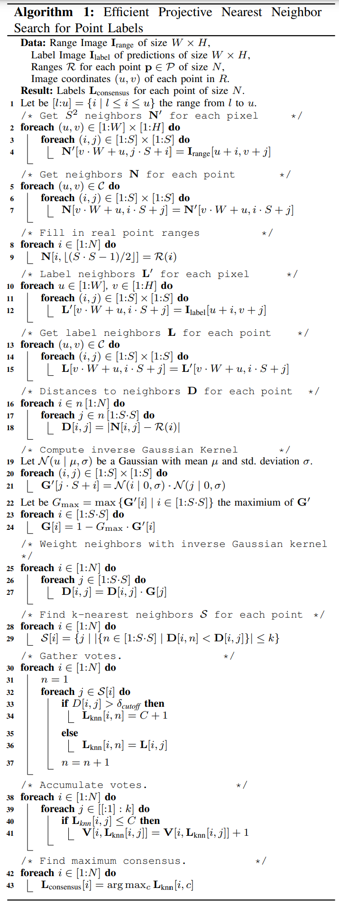

# salsanext-postprocessing-vpro


## Getting started

there is a [python demo](https://git.ims-as.uni-hannover.de/renke/salsanext-postprocessing-vpro/-/tree/karimi-main-patch-24309/Post_pro_python_demo) to underestand the algorythm better.

the [Vpro](https://git.ims-as.uni-hannover.de/renke/salsanext-postprocessing-vpro/-/tree/karimi-main-patch-24309/vpor_post_pro/vpro/knn_post_pro)  implantation is not finished yet but the label2d neibor algorythm aka. L_prim is writhen completly and works fine.
try:

```
make release
```

## output testing

for checking the output result you can run the [output_tester](https://git.ims-as.uni-hannover.de/renke/salsanext-postprocessing-vpro/-/blob/karimi-main-patch-24309/vpor_post_pro/vpro/knn_post_pro/data/output_tester.ipynb)



Source: A. Milioto, I. Vizzo, J. Behley and C. Stachniss, "RangeNet ++: Fast and Accurate LiDAR Semantic Segmentation," 2019 IEEE/RSJ International.

